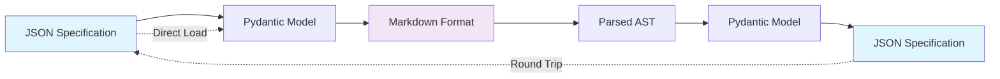

# Format Conversion

<i data-feather="repeat" style="color: var(--md-primary-fg-color);"></i> Seamlessly convert agent specifications between JSON and Markdown formats with full fidelity preservation.

---

Agent Script Tools provides bi-directional conversion between structured JSON specifications and human-readable Markdown formats. This allows you to work in your preferred format while maintaining compatibility across different tools and workflows.

## <i data-feather="shuffle" style="color: var(--md-primary-fg-color);"></i> Conversion Overview

The conversion system preserves all specification data through round-trip conversions:



---

## <i data-feather="terminal" style="color: var(--md-primary-fg-color);"></i> CLI Commands

### Basic Conversion Commands

=== "JSON to Markdown"

    ```bash
    # Convert JSON specification to Markdown
    uv run convert-to-markdown examples/ai-engineer.json
    
    # Save output to file
    uv run convert-to-markdown examples/ai-engineer.json -o output/agent.md
    
    # View with specific output path
    uv run convert-to-markdown spec.json --output docs/agent-spec.md
    ```

=== "Markdown to JSON"

    ```bash
    # Convert Markdown specification to JSON
    uv run convert-to-json examples/ai-engineer.md
    
    # Save output to file
    uv run convert-to-json examples/ai-engineer.md -o output/agent.json
    
    # View with custom path
    uv run convert-to-json spec.md --output dist/specification.json
    ```

=== "View Examples"

    ```bash
    # Show built-in example in JSON format
    uv run agent-script-json
    
    # Show built-in example in Markdown format
    uv run agent-script-markdown
    
    # View the specification schema
    uv run show-spec-json
    ```

### Command Options

| Option | Description | Example |
|--------|-------------|---------|
| `-o, --output` | Specify output file path | `--output result.md` |
| Input file | Path to source specification | `examples/ai-engineer.json` |

---

## <i data-feather="code" style="color: var(--md-primary-fg-color);"></i> Programmatic Usage

### Python API

Use the conversion functions directly in your Python code:

```python
from agent_script_spec.models import AgentScriptSpecification
from agent_script_tools.drivers import to_markdown, from_markdown
import json

# Load JSON specification
with open("examples/ai-engineer.json") as f:
    spec = AgentScriptSpecification.model_validate_json(f.read())

# Convert to Markdown
markdown_content = to_markdown(spec)
print(markdown_content[:200] + "...")

# Convert back from Markdown
spec_from_md = from_markdown(markdown_content)

# Verify round-trip conversion
assert spec == spec_from_md
print("✅ Round-trip conversion successful!")
```

### Batch Processing

Process multiple specifications:

```python
from pathlib import Path
from agent_script_tools.drivers import to_markdown, from_markdown
from agent_script_spec.models import AgentScriptSpecification

def convert_directory(input_dir: Path, output_dir: Path, to_format: str):
    """Convert all specifications in a directory."""
    output_dir.mkdir(exist_ok=True)
    
    for file_path in input_dir.glob("*.json" if to_format == "md" else "*.md"):
        print(f"Converting {file_path.name}...")
        
        if to_format == "md":
            # JSON to Markdown
            spec = AgentScriptSpecification.model_validate_json(file_path.read_text())
            output_content = to_markdown(spec)
            output_file = output_dir / f"{file_path.stem}.md"
        else:
            # Markdown to JSON
            spec = from_markdown(file_path.read_text())
            output_content = spec.model_dump_json(indent=2)
            output_file = output_dir / f"{file_path.stem}.json"
        
        output_file.write_text(output_content)
        print(f"✅ Saved {output_file}")

# Usage
convert_directory(Path("specifications/json"), Path("specifications/md"), "md")
```

---

## <i data-feather="file-text" style="color: var(--md-primary-fg-color);"></i> Markdown Format Structure

The Markdown format follows a structured layout with frontmatter:

### Complete Structure

```markdown
---
name: agent-name
description: Brief description of the agent
tools: tool1, tool2, tool3
model: claude-3-5-sonnet
---

# Agent Name

## Role

Agent's primary role and function

## Expertise

Domain knowledge and technical skills

### Key Capabilities

* Capability 1: Detailed description
* Capability 2: Detailed description

### MCP Integration

* server-name: Description of integration

### Tool Usage

* category: Usage description

### Communication Protocol

Communication guidelines and preferences

## Interaction Model

Description of the interaction approach

### Phase 1

Phase description

Step 1: Step description
Step 2: Step description with complex substeps

* Substep A: Description
* Substep B: Description

#### End of Phase Instructions

Instructions for phase completion

### Phase 2

Next phase description...

## Final Instructions

### Core Competencies

* Competency: Description

### Guiding Principles

* Principle: Description

### Rules

#### DO

* Positive behavioral guideline
* Another positive rule

#### DO NOT

* Negative behavioral constraint
* Another constraint

### Approach

* Method: Approach description

## Deliverables

Essential outputs from the agent

* Deliverable: Description and format requirements
```

---

## <i data-feather="layers" style="color: var(--md-primary-fg-color);"></i> Conversion Features

### Frontmatter Handling

The system automatically manages YAML frontmatter:

=== "Input JSON"

    ```json
    {
      "frontmatter": {
        "name": "data-analyst",
        "description": "Specialized data analysis agent",
        "tools": ["pandas", "matplotlib", "seaborn"],
        "model": "claude-3-5-sonnet"
      }
    }
    ```

=== "Output Markdown"

    ```markdown
    ---
    name: data-analyst
    description: Specialized data analysis agent
    tools: pandas, matplotlib, seaborn
    model: claude-3-5-sonnet
    ---
    
    # Data Analyst
    ...
    ```

### Complex Step Preservation

Multi-level steps are preserved accurately:

=== "JSON Structure"

    ```json
    {
      "steps": {
        "Step 1": "Simple step description",
        "Step 2": {
          "description": "Complex step with substeps",
          "steps": {
            "Substep A": "First substep",
            "Substep B": "Second substep"
          }
        }
      }
    }
    ```

=== "Markdown Output"

    ```markdown
    Step 1: Simple step description
    Step 2: Complex step with substeps
    
    * Substep A: First substep
    * Substep B: Second substep
    ```

### MCP Server Detection

MCP servers are automatically extracted from tools:

```python
# Frontmatter tools
tools = {
    "read", "write", 
    "mcp__context7__get-library-docs",
    "mcp__sequential-thinking__analyze"
}

# Automatically detected MCP servers
mcp_servers = ["context7", "sequential-thinking"]
```

---

## <i data-feather="alert-triangle" style="color: var(--md-primary-fg-color);"></i> Conversion Gotchas

### Common Issues

!!! warning "Tool List Format"
    **Issue**: Tools in JSON are arrays, but Markdown frontmatter uses comma-separated strings
    
    **Solution**: The converter handles this automatically, but be aware when manually editing:
    ```yaml
    # Correct frontmatter format
    tools: read, write, execute
    
    # Not: tools: ["read", "write", "execute"]
    ```

!!! warning "Step Numbering"
    **Issue**: Markdown parsing requires exact "Step N:" format
    
    **Solution**: Always use the exact pattern:
    ```markdown
    # Correct
    Step 1: Description
    Step 2: Another description
    
    # Incorrect  
    Step 1) Description
    1. Description
    ```

!!! warning "Phase Numbering"
    **Issue**: Phases must follow "Phase N" pattern exactly
    
    **Solution**: Use consistent naming:
    ```markdown
    # Correct
    ### Phase 1
    ### Phase 2
    
    # Incorrect
    ### Phase One
    ### First Phase
    ```

### Validation During Conversion

The conversion process includes automatic validation:

```python
try:
    # This will validate the specification
    spec = from_markdown(markdown_content)
    print("✅ Valid specification")
except ValueError as e:
    print(f"❌ Validation error: {e}")
```

---

## <i data-feather="refresh-cw" style="color: var(--md-primary-fg-color);"></i> Round-trip Testing

Verify your conversions preserve data integrity:

### Manual Testing

```python
from agent_script_tools.drivers import to_markdown, from_markdown
from agent_script_spec.models import AgentScriptSpecification

# Load original specification
original = AgentScriptSpecification.model_validate_json(json_content)

# Convert to Markdown and back
markdown = to_markdown(original)
converted = from_markdown(markdown)

# Verify equality
if original == converted:
    print("✅ Perfect round-trip conversion!")
else:
    print("❌ Data loss detected in conversion")
    
    # Find differences
    original_dict = original.model_dump()
    converted_dict = converted.model_dump()
    
    # Use deepdiff or manual comparison
    print("Original keys:", set(original_dict.keys()))
    print("Converted keys:", set(converted_dict.keys()))
```

### Automated Testing

Create test cases for your specifications:

```python
import pytest
from pathlib import Path

def test_round_trip_conversion():
    """Test that all example specifications convert cleanly."""
    examples_dir = Path("examples")
    
    for json_file in examples_dir.glob("*.json"):
        # Test JSON -> Markdown -> JSON
        original_spec = AgentScriptSpecification.model_validate_json(
            json_file.read_text()
        )
        
        markdown = to_markdown(original_spec)
        converted_spec = from_markdown(markdown)
        
        assert original_spec == converted_spec, f"Round-trip failed for {json_file}"
        
        # Test key properties are preserved
        assert original_spec.name == converted_spec.name
        assert original_spec.frontmatter.tools == converted_spec.frontmatter.tools
        assert len(original_spec.interaction_model.phases) == len(converted_spec.interaction_model.phases)
```

---

## <i data-feather="clipboard" style="color: var(--md-primary-fg-color);"></i> Best Practices

### When to Use Each Format

=== "JSON Format"

    **Best for:**
    
    - Programmatic generation and processing
    - API integrations and data exchange
    - Automated validation and testing
    - Storage in databases or configuration systems
    
    **Advantages:**
    
    - Strict structure and validation
    - Easy parsing in any programming language
    - Compact storage format
    - Direct compatibility with Pydantic models

=== "Markdown Format"

    **Best for:**
    
    - Human review and editing
    - Documentation and version control
    - Collaborative specification development
    - Integration with documentation systems
    
    **Advantages:**
    
    - Human-readable and editable
    - Version control friendly
    - Supports rich formatting and comments
    - Easy to review in pull requests

### Workflow Recommendations

1. **Development**: Start with Markdown for human readability
2. **Validation**: Convert to JSON to validate structure
3. **Production**: Use JSON for automated systems
4. **Documentation**: Keep Markdown versions for team review

### File Organization

```
specifications/
├── json/                    # Production specifications
│   ├── ai-engineer.json
│   └── data-analyst.json
├── markdown/               # Human-readable versions
│   ├── ai-engineer.md
│   └── data-analyst.md
└── scripts/
    └── sync-formats.py     # Keep formats in sync
```

---

## <i data-feather="arrow-right" style="color: var(--md-primary-fg-color);"></i> Next Steps

<div class="grid cards" markdown>

-   <i data-feather="link" style="color: var(--md-primary-fg-color);"></i> **[MCP Integration](mcp-integration.md)**

    ---

    Understand Model Context Protocol server integration

-   <i data-feather="activity" style="color: var(--md-primary-fg-color);"></i> **[Examples](../examples/)**

    ---

    Explore real-world agent specifications and conversion examples

</div>
