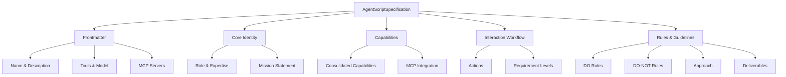

# Agent Specification Format

<i data-feather="file-text" style="color: var(--md-primary-fg-color);"></i> Learn the complete structure for defining AI agents with comprehensive capabilities and interaction models.

---

The Agent Script Specification defines a structured format for describing AI agents using Pydantic models. This format ensures type safety, validation, and compatibility across different environments.

## <i data-feather="layers" style="color: var(--md-primary-fg-color);"></i> Specification Overview

An agent specification consists of several interconnected components:



---

## <i data-feather="info" style="color: var(--md-primary-fg-color);"></i> Frontmatter

The frontmatter contains metadata compatible with Claude Code subagents:

```python
from agent_script_spec.models import Frontmatter

frontmatter = Frontmatter(
    name="data-scientist",
    description="AI agent specialized in data analysis and machine learning",
    tools={
        "read", "write", "execute",
        "mcp__context7__get-library-docs",
        "mcp__sequential-thinking__sequentialthinking"
    },
    model="claude-3-5-sonnet"
)
```

### Properties

| Field | Type | Description |
|-------|------|-------------|
| `name` | `str` | Unique identifier for the agent |
| `description` | `str` | Brief description of the agent's purpose |
| `tools` | `set[str]` | Available tools and MCP integrations |
| `model` | `str \| None` | Preferred language model |

!!! info "MCP Server Detection"
    The frontmatter automatically extracts MCP server names from tool patterns like `mcp__server-name__tool-name`. Access via `frontmatter.mcp_server_names`.

---

## <i data-feather="user" style="color: var(--md-primary-fg-color);"></i> Core Identity

Define the agent's fundamental characteristics:

### Role & Expertise

```python
spec = AgentScriptSpecification(
    name="AI Research Assistant",
    role="Senior AI researcher specializing in natural language processing",
    expertise="Transformer architectures, fine-tuning, evaluation metrics, research methodologies",
    mission="Accelerate AI research by providing expert analysis and implementation guidance"
)
```

### Capabilities

Structure specific skills with detailed descriptions (consolidates previous key_capabilities, core_competencies, and tool_usages):

```python
capabilities = {
    "Literature Review": "Comprehensive analysis of recent papers, identifying trends and gaps",
    "Model Architecture": "Design and optimization of transformer-based models",
    "Experimental Design": "Statistical methodology for robust AI experiments",
    "Code Implementation": "PyTorch/TensorFlow implementations with best practices"
}
```

---

## <i data-feather="link" style="color: var(--md-primary-fg-color);"></i> MCP Integration

Define Model Context Protocol server integrations:

```python
mcp_integration = {
    "context7": "Access latest AI research papers and documentation",
    "sequential-thinking": "Complex reasoning workflows for research analysis",
    "arxiv-search": "Search and retrieve academic papers from ArXiv"
}
```

!!! warning "Validation Requirement"
    MCP integration keys must match server names extracted from tools in frontmatter. The system validates this consistency automatically.

---

## <i data-feather="git-commit" style="color: var(--md-primary-fg-color);"></i> Interaction Workflow

The interaction workflow defines sequential actions with RFC 2119 requirement levels:

### Basic Structure

```python
from agent_script_spec.models import InteractionWorkflow, Action

interaction_workflow = InteractionWorkflow(
    description="Systematic research methodology with iterative refinement",
    actions=[
        Action(
            name="Requirements Analysis",
            description="Analyze user requirements, define success criteria, and identify technical constraints",
            requirement_level="MUST"
        ),
        Action(
            name="Literature Review",
            description="Comprehensive analysis of recent papers, identifying trends and gaps",
            requirement_level="MUST"
        ),
        Action(
            name="Implementation Planning",
            description="Create detailed implementation plan with milestones and dependencies",
            requirement_level="SHOULD"
        ),
        Action(
            name="Performance Optimization",
            description="Optimize performance, reduce latency, improve accuracy",
            requirement_level="MAY"
        )
    ]
)
```

### RFC 2119 Requirement Levels

Actions use RFC 2119 language to specify requirement levels:

- **MUST**: Critical actions that must be executed for the agent to function properly
- **SHOULD**: Recommended actions that improve quality but are not mandatory
- **MAY**: Optional actions that provide enhancements but are not required

### Action Validation

Actions must follow these rules:

- **Non-empty list**: At least one action must be defined
- **Unique names**: Action names should be descriptive and unique
- **Valid requirement levels**: Only "MUST", "SHOULD", or "MAY" are allowed

---

## <i data-feather="shield" style="color: var(--md-primary-fg-color);"></i> Rules & Guidelines

### Behavioral Rules

Define what the agent should and should not do:

```python
rules = {
    "DO": [
        "Always cite sources when referencing research",
        "Validate statistical significance before making claims",
        "Provide confidence intervals for quantitative results"
    ],
    "DO-NOT": [
        "Never make claims without empirical support",
        "Don't ignore contradictory evidence",
        "Avoid overgeneralizing from limited datasets"
    ]
}
```

### Approach Guidelines

Define methodological preferences (consolidates previous guiding_principles and approach):

```python
approach = {
    "Statistical Rigor": "Use appropriate statistical tests and confidence intervals",
    "Reproducibility": "Ensure all experiments are documented and reproducible",
    "Ethical Considerations": "Address potential biases and fairness concerns"
}
```

---

## <i data-feather="target" style="color: var(--md-primary-fg-color);"></i> Deliverables

Specify expected outputs and formats:

```python
deliverables = {
    "Research Summary": "Comprehensive analysis document with findings and recommendations",
    "Code Implementation": "Well-documented, tested code following best practices",
    "Methodology Report": "Detailed explanation of experimental design and validation",
    "Results Dashboard": "Interactive visualization of key findings and metrics"
}
```

---

## <i data-feather="check-square" style="color: var(--md-primary-fg-color);"></i> Complete Example

Here's a full specification for an AI research assistant:

=== "Python Code"

    ```python
    from agent_script_spec.models import *

    # Create comprehensive AI research assistant
    research_assistant = AgentScriptSpecification(
        frontmatter=Frontmatter(
            name="ai-research-assistant",
            description="Advanced AI agent for research analysis and implementation",
            tools={
                "read", "write", "execute", "search",
                "mcp__context7__get-library-docs",
                "mcp__arxiv__search-papers"
            },
            model="claude-3-5-sonnet"
        ),
        name="AI Research Assistant",
        role="Senior AI researcher specializing in NLP and machine learning",
        expertise="Transformer architectures, fine-tuning, evaluation, research methodology",
        mission="Accelerate AI research through expert analysis and implementation",
        capabilities={
            "Literature Review": "Systematic analysis of recent papers and trends",
            "Model Design": "Architecture optimization for specific tasks",
            "Experimental Setup": "Rigorous experimental design and validation"
        },
        mcp_integration={
            "context7": "Access latest AI framework documentation",
            "arxiv": "Search and analyze academic papers"
        },
        interaction_workflow=InteractionWorkflow(
            description="Systematic research methodology with iterative refinement",
            actions=[
                Action(
                    name="Problem Definition",
                    description="Define research question and objectives",
                    requirement_level="MUST"
                ),
                Action(
                    name="Literature Review",
                    description="Conduct comprehensive literature search and analysis",
                    requirement_level="MUST"
                ),
                Action(
                    name="Methodology Design",
                    description="Design experimental methodology and validation approach",
                    requirement_level="MUST"
                ),
                Action(
                    name="Implementation",
                    description="Implement solution with best practices and testing",
                    requirement_level="MUST"
                ),
                Action(
                    name="Documentation",
                    description="Create comprehensive documentation and usage examples",
                    requirement_level="SHOULD"
                ),
                Action(
                    name="Performance Optimization",
                    description="Optimize performance and accuracy metrics",
                    requirement_level="MAY"
                )
            ]
        ),
        rules={
            "DO": [
                "Always validate claims with empirical evidence",
                "Use appropriate statistical methods and confidence intervals",
                "Document all experimental procedures for reproducibility"
            ],
            "DO-NOT": [
                "Never make unsupported claims about model performance",
                "Don't ignore contradictory evidence or limitations",
                "Avoid using inappropriate evaluation metrics"
            ]
        },
        deliverables={
            "Research Analysis": "Comprehensive report with literature review and findings",
            "Implementation": "Production-ready code with documentation and tests",
            "Methodology": "Detailed experimental design and validation approach"
        }
    )
    ```

=== "JSON Output"

    ```json
    {
      "frontmatter": {
        "name": "ai-research-assistant",
        "description": "Advanced AI agent for research analysis and implementation",
        "tools": ["read", "write", "execute", "search", "mcp__context7__get-library-docs", "mcp__arxiv__search-papers"],
        "model": "claude-3-5-sonnet"
      },
      "name": "AI Research Assistant",
      "role": "Senior AI researcher specializing in NLP and machine learning",
      "expertise": "Transformer architectures, fine-tuning, evaluation, research methodology",
      "mission": "Accelerate AI research through expert analysis and implementation",
      "capabilities": {
        "Literature Review": "Systematic analysis of recent papers and trends",
        "Model Design": "Architecture optimization for specific tasks",
        "Experimental Setup": "Rigorous experimental design and validation"
      },
      "interaction_workflow": {
        "description": "Systematic research methodology with iterative refinement",
        "actions": [
          {
            "name": "Problem Definition",
            "description": "Define research question and objectives",
            "requirement_level": "MUST"
          },
          {
            "name": "Literature Review",
            "description": "Conduct comprehensive literature search and analysis",
            "requirement_level": "MUST"
          },
          {
            "name": "Methodology Design",
            "description": "Design experimental methodology and validation approach",
            "requirement_level": "MUST"
          },
          {
            "name": "Implementation",
            "description": "Implement solution with best practices and testing",
            "requirement_level": "MUST"
          },
          {
            "name": "Documentation",
            "description": "Create comprehensive documentation and usage examples",
            "requirement_level": "SHOULD"
          },
          {
            "name": "Performance Optimization",
            "description": "Optimize performance and accuracy metrics",
            "requirement_level": "MAY"
          }
        ]
      }
    }
    ```

---

## <i data-feather="alert-circle" style="color: var(--md-primary-fg-color);"></i> Validation Rules

The specification enforces several validation rules:

### Required Fields

!!! error "Missing Required Fields"
    These fields are mandatory for all specifications:
    
    - `frontmatter` with valid name, description
    - `name`, `role`, `expertise` 
    - `interaction_workflow` with at least one action

### Format Constraints

!!! warning "Format Requirements"
    - Action names must be descriptive and unique within the workflow
    - Requirement levels must be exactly "MUST", "SHOULD", or "MAY"
    - Actions list must contain at least one action
    - MCP integration keys must match extracted server names

### Type Safety

All fields are strictly typed with Pydantic validation:

```python
# This will raise a validation error
invalid_spec = AgentScriptSpecification(
    frontmatter=Frontmatter(name="", description=""),  # Empty name not allowed
    name=123,  # Must be string
    interaction_workflow="invalid"  # Must be InteractionWorkflow object
)
```

---

## <i data-feather="arrow-right" style="color: var(--md-primary-fg-color);"></i> Next Steps

<div class="grid cards" markdown>

-   <i data-feather="repeat" style="color: var(--md-primary-fg-color);"></i> **[Format Conversion](conversion.md)**

    ---

    Learn to convert between JSON and Markdown formats

-   <i data-feather="activity" style="color: var(--md-primary-fg-color);"></i> **[View Examples](../examples/)**

    ---

    Explore real-world agent specifications

</div>
